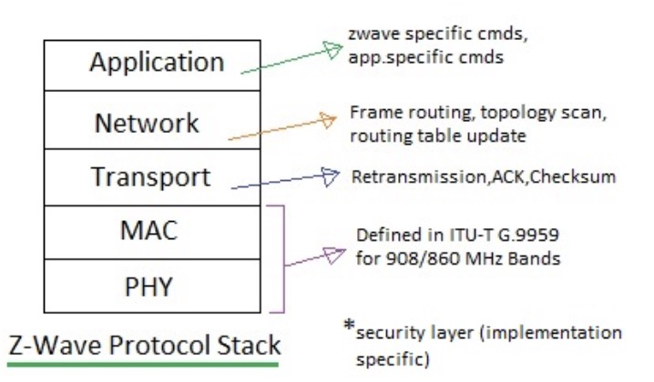
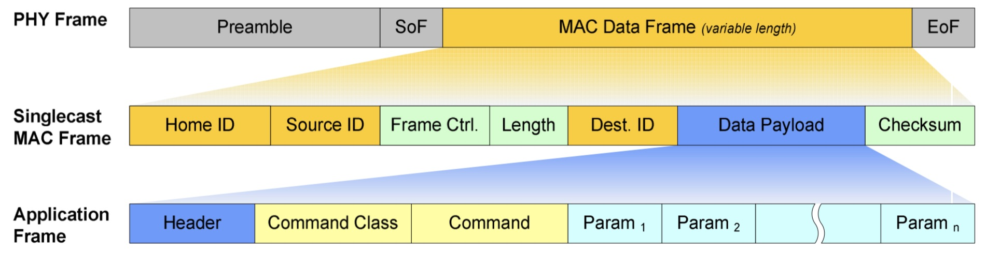
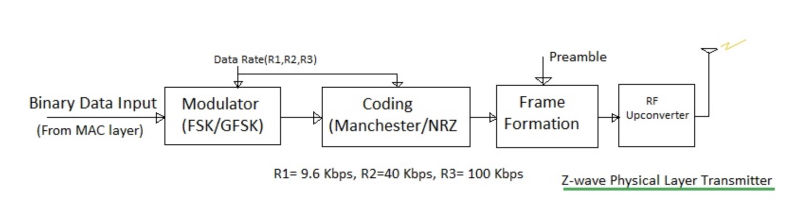
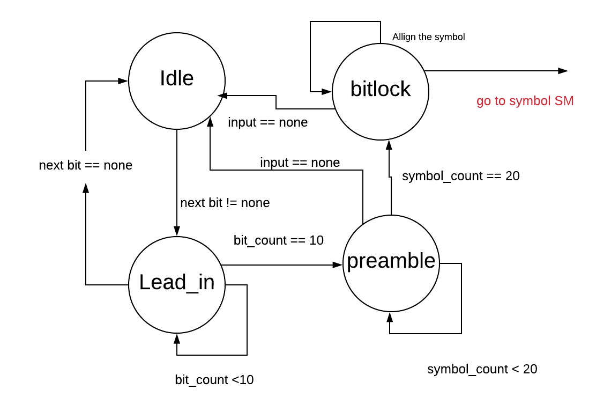
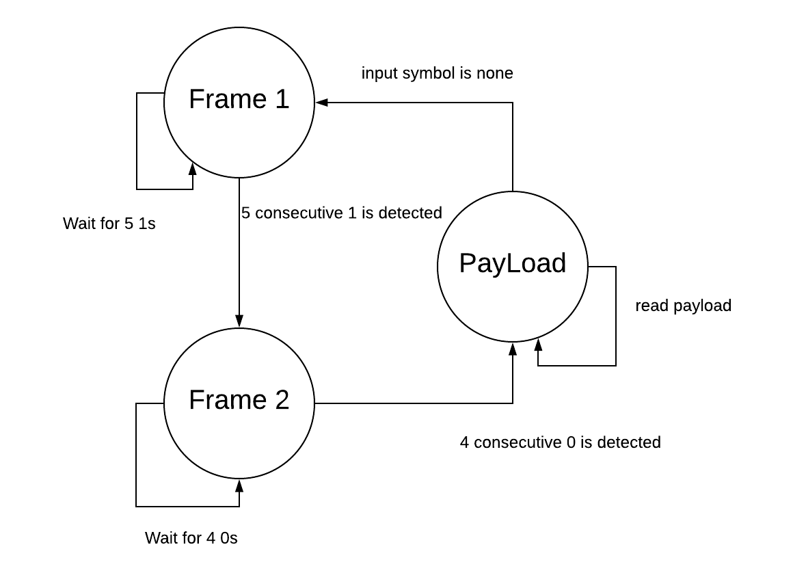
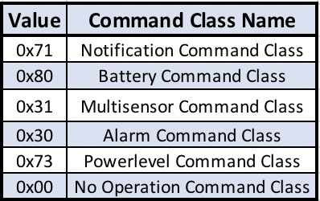
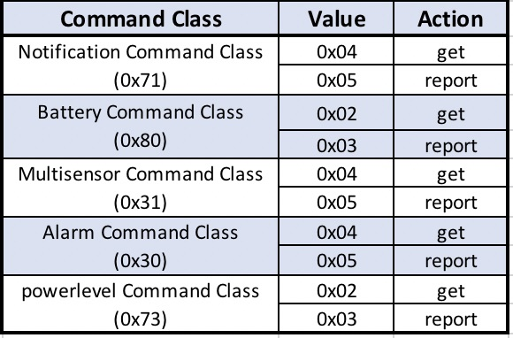
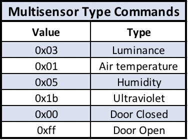
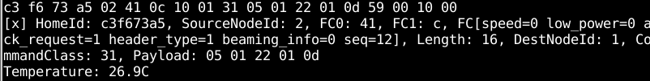
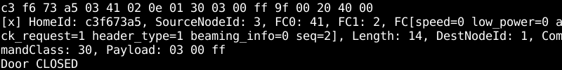

# Sniffing Z-wave home sensors with SDR

This project aims to receive Z-wave home sensors signal with RTL-SDR and identify home activities based on Z-wave sensors data. 

# What is Z-wave? 

As a wireless communication protocol, Z-Wave uses radio frequency signals to control compatible devices, which has been primarily used for home automation due to its low-energy consuming and efficient data exchange. Specifically, Z-Wave operates in a frequency range from 800 MHz to 900 MHz within 100 meters.

Z-Wave protocol formed a mesh network, which means that all devices under the same Z-Wave network can communicate with each other. One primary controller can add up to 232 nodes in its network by sending its unique controller ID assigned by the manufacturers to paired nodes. There are two types of modes in Z-Wave devices. The first one is called inclusion meaning that adding this new Z-Wave device to the controller network; whereas exclusion refers to remove this node from current network. When pairing up Z-Wave devices and the primary controller, a unique Node ID will be handed out to the devices as well. 

When transmitting the data, sending node will have to obtain a ACK message to confirm the transmission success; otherwise, this transmission will be regarded as failed.
 
As shown in Figure 1, Z-Wave protocol is composed of five layers, which are PHY layer, MAC layer, transport layer, network layer and application layer. 

 

As shown in Figure 2, physical frame consists of preamble and start of frame(SoF) for detection of valid MAC layer data frame containing device information and payload, then ended with end of frame(EoF). MAC Data Frame can then be divided into Home ID(32 bits), Source ID(8 bits), Frame Control(16 bits), Length(8 bits), Destination ID(8 bits), Data Payload as well as Checksum. Frame control determines frame type used in transport layer including singlecast, ACK, multicast, and broadcast. Figure 2 shows MAC singlecast Frame specifically. In the application layer, Data Payload is composed of Command Class(8 bits), Command(8 bits) and multiple parameters. 

 

# Implementation
## RTL-SDR
RTL-SDR is a cheap (about $20) SDR receiver. With Osmocom package installed, the I/Q signal received from RTL-SDR can be read from computer and can be converted to work with SDR software such as Gnuradio. 
The frequency range of RTL-SDR is from 24 to 1766 MHz, which enables us to receive Z-wave signal with it. The available sample rate are 225 to 300 KHZ  and 900K to 3MHZ. 
Device Website: https://www.rtl-sdr.com/about-rtl-sdr/
## Antenna:
This antenna is primarily used for signals between 700 MHz and 1200 MHz.
## Z-wave Sensors
In this project, we targeted in two Z-wave sensors.
MultiSensor 6 (ZW100-A) is manufactured by Aeotec and consists of motion sensor, temperature sensor, light sensor, humidity sensor, vibration sensor, UV sensor. We place it on the wall of our test room.
Door and Window Sensor is manufactured by ecolink and can send binary signal of open and close action. The sensor consists of the magnet and the detector. We place the detector on the wall besides the door and the magnet on the door. When the magnet is close to the detector, it sends the close signal and vice versa. 
## Z-stick
Z-stick gen 5 manufactured by Aeotec serves as a hub of these sensors. It’s a controller that connected to each sensors and gather data from them. It’s used with UI software that can display real-time home condition to the user. 
## Openhab
Openhab is the software to be install at the PC that read data from z-stick. It displays the message on UI for user to understand their home condition
## Code
We use the code from https://github.com/baol/waving-z as major reference of demodulation of Z-wave signal.
## Putting it all together
The two Z-wave sensors are paired with the Z-stick. The Openhab is installed on Mac OS and Z-stick is connected to Mac to provide sensor data to UI. RTL-SDR is operating in Linux computer and we set the center frequency of the receiver to 908.42MHz and sample rate to 2MHz. A Zwave decoder program wriiten in C++ demodulates the signal and write each Z-wave instruction to output file.

# Major Algorithm
 
## Demodulator:
## Sample State Machine
 

**Idle**: Whenever the input bit is none, the state rest in Idle state. It move to the Lead_in state when input bit is not none.

**Lead_in**: The pattern of preamble is 01010101.This state skip 10 symbol of the preamble. Check if this bit equal to the last bit. If yes, increase the counter of symbol. 

**Preamble**: Use the preamble to calculate the sample per symbol rate. Read at least 20 preamble. Keep count of the sample_count and symbol count. After 20 symbol count, the sps= sample_count/symbol count

**Bitlock**: skip the current incomplete symbol and direct to symbol SM. 

## Symbol State Machine
 
**Frame 1**: detect the first byte (0xff) of start of frame 

**Frame 2**: detect the second byte (0x00) of SoF

**Payload**: Reading and store as struct payload 

### Result Interpretation 

When the primary controller is communicating with the nodes in its network, it should send out command class. However, if the specific node does not acknowledge data from the controller, header_type (first 8 bits) of Frame control will be 03; otherwise, it should be 41 to indicate header_type 1 for controller to provide data to its node. 

The command class locates at the 9th byte in Z-wave instruction. Followings are the major command classes our sensor send out. We will be targeting the class 0x30 for the binary action of door/window sensor and 0x31 for multilevel sensor.  The byte after the 0x30 command class is the command type. For instance, in door/window sensor, the 10th byte we received is 0x05, which is the reporting door and window action to the controller. In the case of multilevel sensor, the byte following the command class represent the action of sensor. 0x40 is the get command sent from the controller and 0x50 is the report command sent from the sensor to report a particular value.  
A little bit more about the multilevel sensor instruction. As we mentioned above, 9th byte in the instruction represents the command class and 10th byte represents the action. The 11th byte represents the sensor type of the sensor. 

 
 

A little bit more about the multilevel sensor instruction. As we mentioned above, 9th byte in the instruction represents the command class and 10th byte represents the action. The 11th byte represents the sensor type of the sensor. With these information given, we're able to identify unknown sensor by sniffing the Z-wave packet.

  

We also decode the information sending from the multilevel sensor and door sensor to the hub. And output the same value as the information picking up from hub. 

 

 

### Expand to unkown home setting
Suppose we're giving an unknown home with Z-wave sensors and hub already connected. We can sniff the packet by implanting the SDR in a hidden location inside or outside the house to gather Z-wave packet. Then we map the command class from Z-wave dataset to identify unknown home Z-wave device setting. We can identify the sensor type and its command content. 
``
Found home device:  c3f673a5
It has following node: 
Node  03
This Node has the following command class: 
Binary Sensor
Notification
Wake Up
Node  01
This Node has the following command class: 
Basic
Battery
Powerlevel
Multilevel Sensor
No Operation
Binary Sensor
Node  02
This Node has the following command class: 
Notification
Battery
Powerlevel
Multilevel Sensor

``

###  

Your Pages site will use the layout and styles from the Jekyll theme you have selected in your [repository settings](https://github.com/UCLA-ECE209AS-2018W/Yaying-Yueyang/settings). The name of this theme is saved in the Jekyll `_config.yml` configuration file.

### 

Having trouble with Pages? Check out our [documentation](https://help.github.com/categories/github-pages-basics/) or [contact support](https://github.com/contact) and we’ll help you sort it out.
